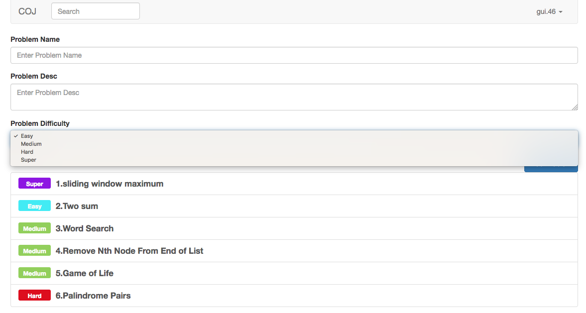
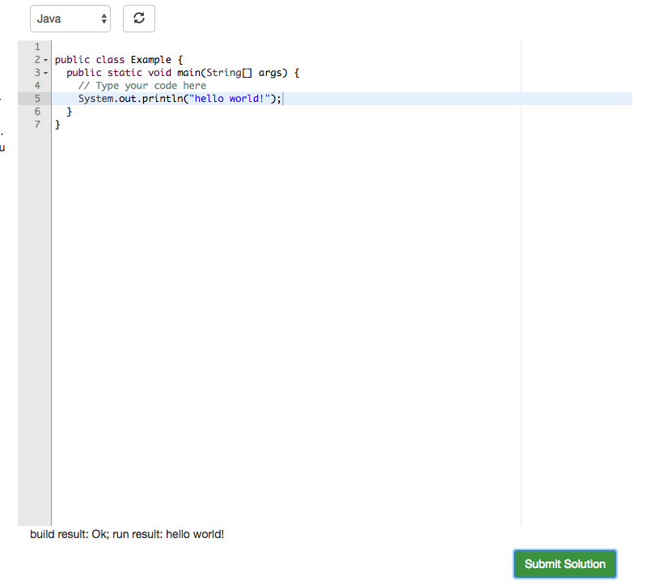

# Collaborative Online Judge Platform
COJ([coj-platform.xinyuangui.com](http://coj-platform.xinyuangui.com/)) is one full-stack system supporting collaborative code editing, compiling, execution system much like "leetcode". But with this platform, you can edit code with your friend together.
## Installation
* Make sure you install [Redis](https://redis.io/), [nodejs](https://nodejs.org/en/),
[docker](https://www.docker.com/),  [angular](https://angular.io/) and [python](https://www.python.org/)
* This app will kill the port `3000` and `5000`. You can configure it in `launcher.sh` and in source code.
* Directly run the bash-script with `./launcher.sh`. And the javascript server and python server will run directly.

## Usage
* User can use interactive code editor to edit code. Supported languages are `Java`, `C++` and `Python`.
* Multiple users can edit the same piece of code simultaneously. Each user's change can be seen and applied to every other user's code immediately.
* User can compile the code directly. The compile result will be displayed to user.
* User's code history will be stored in `redis` for some time. When some others join the code team or someone comes back later, he will fetch the previous code history.
* Admin can manually add new problems.

## Stack Diagram
Stack  |  Technologies
--|--
Frontend - client  |  [angular](https://angular.io/), [socket.io](https://socket.io/)
Frontend - server  |  [nodejs](https://nodejs.org/en/), [socket.io](https://socket.io/), [Redis](https://redis.io/), [MongoDB](https://www.mongodb.com/)
  Backend - executor| [Flask](http://flask.pocoo.org/) , [docker](https://www.docker.com/)  

## Detailed Design
* Editor: Here I use [Ace](https://ace.c9.io/) as the editor. And [socket.io](https://socket.io/) as the communication protocol between client and server.
  * With the API of [Ace](https://ace.c9.io/), client side can get the `change` and `cursor-move` event;
  * Also, the client side will post one `reset code` event when user resets the code or change language;
  * Event will be sent to Server
  * Also , editor will get socket message from server and update
* Authentication and Authorization
  - I use [Auth0](https://auth0.com/) to help me handle the authentication and Authorization.
  - With the `Authorization` plugin, I add `Administrator` role to administrator. And with this role, administrator can add and edit problems.
  
* Editor History: Editing session is the concept similar to file. It keeps the editor history. So that, when some new user comes in or old user comes back later. He will have the latest state.
  - The history will be kept in `Redis` for some time. So, during this time, if user comes back, he will get the history soon. Then, if the history is not visited for a long time, the history will be kept in `MongoDB`.
* User Code Executor: User can submit code, run and get the result through the WebUI. For security reason, we cannot execute user code directly on server. Thus we use `Docker` to run the code.
  - Here, in order not to slow down the frontend server (`nodejs` server), I deploy Docker container on backend server and make it accept execution requests coming from frontend server.
  - Every time the backend server gets the execution requests, it will initialize the `Docker Instance`. After running the code, it will return the error or result back to the webUI.
  
## To do:
* Add judgement function: will judge if the algorithm is right or wrong;
* Better handle the `Authorization`. At present, every problem share the same status. Later I can add the room or privacy function.
